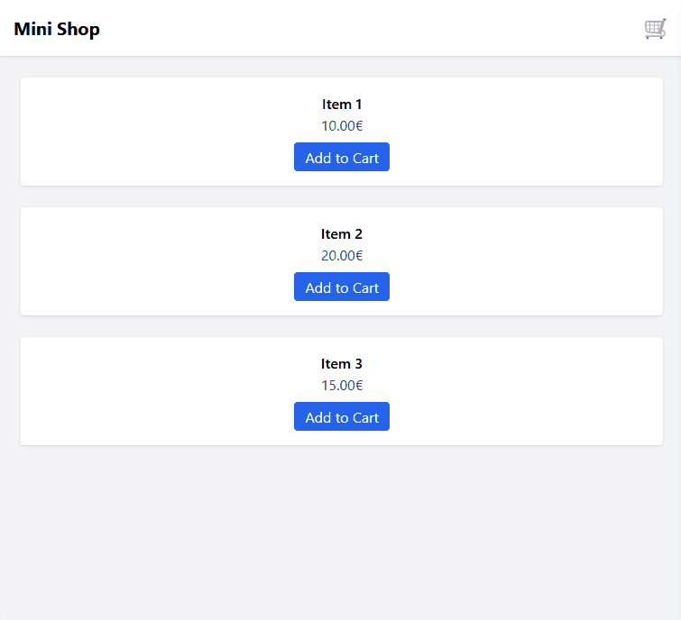

## 📸 Demo



# 🛒 Sidebar Cart (Vanilla JS + Tailwind)

A simple **sidebar shopping cart** built with Tailwind CSS and vanilla JavaScript.  
Includes quantity management, total calculation, and persistent storage with `localStorage`.

---

## ✨ Features
- Slide-in cart sidebar with overlay
- Product cards with “Add to Cart” button
- Quantity management with input field
- Dynamic total and badge update
- Persistent cart with `localStorage`
- Lightweight (no dependencies)

---

## 🚀 Quick Start
```bash
git clone https://github.com/Solerion-fr/sidebar-cart.git
cd sidebar-cart
open index.html
